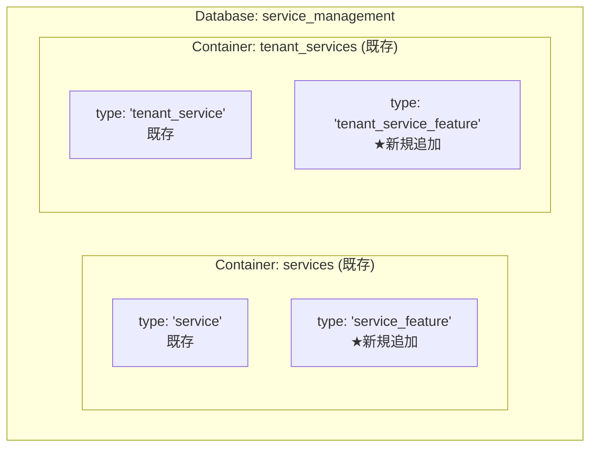
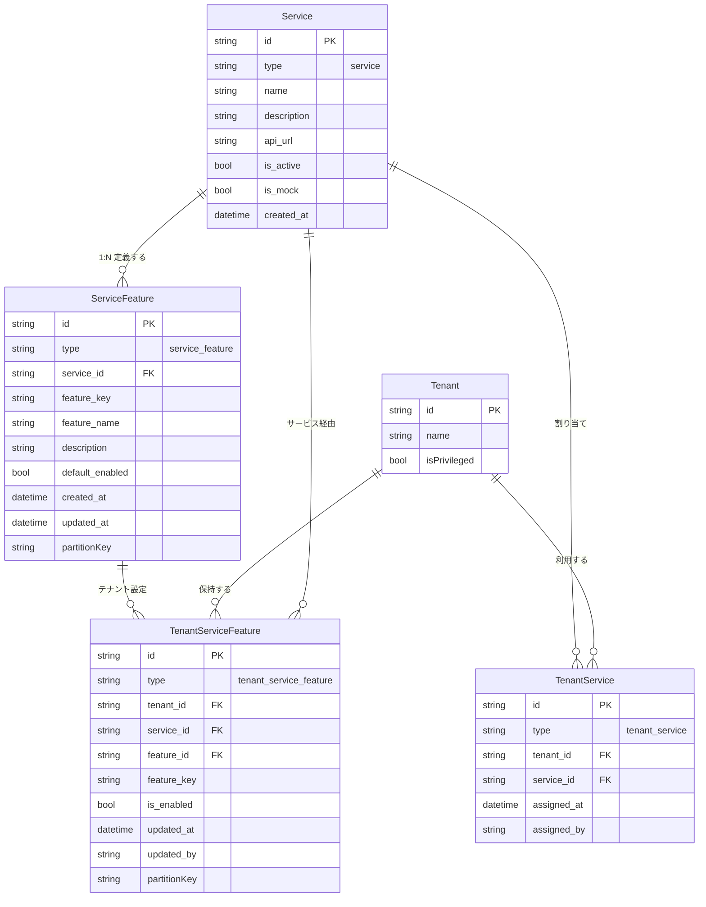

# 03 — データモデル設計

## ドキュメント情報

| 項目 | 値 |
|---|---|
| **ドキュメントID** | SPEC-SFM-03 |
| **バージョン** | 1.1.0 |
| **作成日** | 2026-02-19 |
| **ISO 29148 分類** | SyRS — Data Architecture |
| **ステータス** | Implemented |

---

## 目次

1. [エンティティ設計](#1-エンティティ設計)
2. [CosmosDB コンテナ設計](#2-cosmosdb-コンテナ設計)
3. [エンティティ関連図](#3-エンティティ関連図)
4. [Python モデル定義](#4-python-モデル定義)
5. [クエリパターン](#5-クエリパターン)
6. [シードデータ設計](#6-シードデータ設計)
7. [マイグレーション考慮事項](#7-マイグレーション考慮事項)

---

## 1. エンティティ設計

### 1.1 ServiceFeature（サービス機能マスター）

サービスが提供する機能を定義するマスターエンティティ。サービス1件に対して複数存在する。

```json
{
  "id": "feature-service-004-01",
  "type": "service_feature",
  "service_id": "service-004",
  "feature_key": "version_control",
  "feature_name": "バージョン管理",
  "description": "ファイルのバージョン管理を行う機能",
  "default_enabled": true,
  "created_at": "2026-01-01T00:00:00Z",
  "updated_at": "2026-01-01T00:00:00Z",
  "partitionKey": "service-004"
}
```

**フィールド説明**:

| フィールド | 型 | 必須 | 説明 |
|---|---|---|---|
| `id` | string | ✓ | 機能ID（`"feature-{service_id}-{連番}"`、例: `feature-service-004-01`） |
| `type` | string | ✓ | ドキュメントタイプ（固定値: `"service_feature"`） |
| `service_id` | string | ✓ | 紐付くサービスID（`Service.id` を参照） |
| `feature_key` | string | ✓ | 機械可読キー（英小文字+アンダースコア、サービス内でユニーク） |
| `feature_name` | string | ✓ | 機能の表示名（日本語可） |
| `description` | string | ✓ | 機能の説明 |
| `default_enabled` | boolean | ✓ | テナント設定未登録時のデフォルト有効/無効状態 |
| `created_at` | datetime | ✓ | 作成日時（ISO 8601） |
| `updated_at` | datetime |  | 更新日時（ISO 8601） |
| `partitionKey` | string | ✓ | パーティションキー（= `service_id`） |

**制約**:
- `(service_id, feature_key)` の組み合わせは一意
- `feature_key` はサービス内でユニークであること
- `service_id` は `Service.id` の有効な値であること

---

### 1.2 TenantServiceFeature（テナント別機能設定）

テナントごとのサービス機能の有効/無効状態を記録するエンティティ。設定が存在しない場合は `ServiceFeature.default_enabled` が適用される。

```json
{
  "id": "tenant-sample-001_feature-service-004-02",
  "type": "tenant_service_feature",
  "tenant_id": "tenant-sample-001",
  "service_id": "service-004",
  "feature_id": "feature-service-004-02",
  "feature_key": "file_sharing",
  "is_enabled": true,
  "updated_at": "2026-01-15T09:00:00Z",
  "updated_by": "admin-user-001",
  "partitionKey": "tenant-sample-001"
}
```

**フィールド説明**:

| フィールド | 型 | 必須 | 説明 |
|---|---|---|---|
| `id` | string | ✓ | `"{tenant_id}_{feature_id}"` の複合ID |
| `type` | string | ✓ | ドキュメントタイプ（固定値: `"tenant_service_feature"`） |
| `tenant_id` | string | ✓ | テナントID |
| `service_id` | string | ✓ | サービスID |
| `feature_id` | string | ✓ | `ServiceFeature.id` を参照 |
| `feature_key` | string | ✓ | 機能キー（詳細検索用の冗長フィールド） |
| `is_enabled` | boolean | ✓ | テナントでの有効/無効状態 |
| `updated_at` | datetime | ✓ | 最終更新日時（ISO 8601） |
| `updated_by` | string | ✓ | 最終更新者のユーザーID |
| `partitionKey` | string | ✓ | パーティションキー（= `tenant_id`） |

**制約**:
- `(tenant_id, feature_id)` の組み合わせは一意（Upsert で管理）
- `id` は `"{tenant_id}_{feature_id}"` の命名規則に従う
- `TenantServiceFeature` のレコードが存在しない機能は `ServiceFeature.default_enabled` が適用される

---

## 2. CosmosDB コンテナ設計

### 2.1 格納先の決定方針

既存のコンテナ設計に `type` フィールドによるドキュメント種別管理を踏襲し、新規コンテナは作成しない。



### 2.2 `services` コンテナへの追加

| 設定項目 | 既存値 | 変更 |
|---|---|---|
| パーティションキー | `/id` | **`/partitionKey` で再作成**（詳細下記） |
| TTL | 無効 | 変更なし |

> **⚠ 重要**: **Azure Cosmos DB は既存コンテナーのパーティションキーを後から変更する機能を提供していない**。そのため、`services` コンテナーは一度削除・再作成する必要がある。
>
> **対応手順（開発環境）**:
> 1. `scripts/setup_database.sh` の `services` コンテナー作成処理のパーティションキーを `/partitionKey` に変更する。
> 2. `scripts/seed_data/initial_data.py` の `Service` ドキュメント全件に `"partitionKey": "<id値>"` フィールドを追加する。
> 3. DevContainer を再起動（または `setup_database.sh` を実行）して全 DB を初期化する。

**追加クエリパターン**:

```sql
-- サービス機能マスター一覧取得（パーティション指定）
SELECT * FROM c
WHERE c.type = 'service_feature'
  AND c.service_id = @serviceId
```

### 2.3 `tenant_services` コンテナへの追加

| 設定項目 | 既存値 | 変更 |
|---|---|---|
| パーティションキー | `/tenant_id` | 変更なし |
| TTL | 無効 | 変更なし |

**追加クエリパターン**:

```sql
-- テナント別機能設定取得（パーティション内クエリ）
SELECT * FROM c
WHERE c.tenant_id = @tenantId
  AND c.service_id = @serviceId
  AND c.type = 'tenant_service_feature'
```

---

## 3. エンティティ関連図



---

## 4. Python モデル定義

### 4.1 実装ファイル

実装済みモデルファイル: `app/models/service_feature.py`

```python
from pydantic import BaseModel, Field
from datetime import datetime
from typing import Optional


class ServiceFeature(BaseModel):
    """ServiceFeature CosmosDB document model"""

    id: str = Field(..., description="機能ID (feature-{service_id}-{連番})")
    type: str = Field(default="service_feature")
    service_id: str = Field(...)
    feature_key: str = Field(...)
    feature_name: str = Field(...)
    description: str = Field(default="")
    default_enabled: bool = Field(default=False)
    created_at: datetime = Field(...)
    updated_at: Optional[datetime] = Field(default=None)
    partitionKey: str = Field(...)  # = service_id

    class Config:
        populate_by_name = True


class TenantServiceFeature(BaseModel):
    """TenantServiceFeature CosmosDB document model"""

    id: str = Field(..., description="{tenant_id}_{feature_id}")
    type: str = Field(default="tenant_service_feature")
    tenant_id: str = Field(...)
    service_id: str = Field(...)
    feature_id: str = Field(...)
    feature_key: str = Field(...)
    is_enabled: bool = Field(...)
    updated_at: datetime = Field(...)
    updated_by: str = Field(...)
    partitionKey: str = Field(...)  # = tenant_id

    class Config:
        populate_by_name = True
```

---

## 5. クエリパターン

### 5.1 サービス機能マスター取得

```python
# services コンテナ（パーティションキー = service_id）
query = """
    SELECT * FROM c
    WHERE c.type = 'service_feature'
      AND c.service_id = @serviceId
"""
parameters = [{"name": "@serviceId", "value": service_id}]
items = container.query_items(
    query=query,
    parameters=parameters,
    partition_key=service_id
)
```

**RUコスト想定**: 約 2〜5 RU（機能数は最大5件程度）

### 5.2 テナント別機能設定取得

```python
# tenant_services コンテナ（パーティションキー = tenant_id）
query = """
    SELECT * FROM c
    WHERE c.tenant_id = @tenantId
      AND c.service_id = @serviceId
      AND c.type = 'tenant_service_feature'
"""
parameters = [
    {"name": "@tenantId", "value": tenant_id},
    {"name": "@serviceId", "value": service_id}
]
items = container.query_items(
    query=query,
    parameters=parameters,
    partition_key=tenant_id
)
```

**RUコスト想定**: 約 2〜5 RU（同上）

---

## 6. シードデータ設計

### 6.1 ServiceFeature マスターデータ（19件）

実装済みファイル: `scripts/seed_data/initial_data.py`

| 機能ID | service_id | feature_key | feature_name | default_enabled |
|---|---|---|---|---|
| feature-service-001-01 | service-001 | `audit_log` | 監査ログ | true |
| feature-service-001-02 | service-001 | `auto_backup` | 自動バックアップ | false |
| feature-service-002-01 | service-002 | `mfa` | 多要素認証 (MFA) | false |
| feature-service-002-02 | service-002 | `password_policy` | 強化パスワードポリシー | true |
| feature-service-002-03 | service-002 | `session_audit` | セッション監査 | false |
| feature-service-003-01 | service-003 | `service_report` | サービス利用レポート | true |
| feature-service-003-02 | service-003 | `auto_provisioning` | 自動プロビジョニング | false |
| feature-service-004-01 | service-004 | `version_control` | バージョン管理 | true |
| feature-service-004-02 | service-004 | `file_sharing` | ファイル外部共有 | false |
| feature-service-004-03 | service-004 | `auto_backup` | 自動バックアップ | true |
| feature-service-005-01 | service-005 | `email_notification` | メール通知 | true |
| feature-service-005-02 | service-005 | `sms_notification` | SMS通知 | false |
| feature-service-005-03 | service-005 | `push_notification` | プッシュ通知 | false |
| feature-service-006-01 | service-006 | `usage_analytics` | 利用分析エクスポート | true |
| feature-service-006-02 | service-006 | `rate_limiting` | レートリミット設定 | true |
| feature-service-006-03 | service-006 | `api_audit_log` | API監査ログ | false |
| feature-service-007-01 | service-007 | `incremental_backup` | 増分バックアップ | true |
| feature-service-007-02 | service-007 | `cross_region_backup` | クロスリージョンバックアップ | false |
| feature-service-007-03 | service-007 | `auto_schedule` | 自動スケジュール | true |

### 6.2 TenantServiceFeature サンプルデータ

実装済みファイル: `scripts/seed_data/sample_data.py`

サンプルテナント（`tenant-sample-001` 〜 `tenant-sample-005`）の割り当て済みサービスに対して、一部機能のテナント設定を定義している。各テナントに 2〜3 件のカスタム設定を用意。

---

## 7. マイグレーション考慮事項

### 7.1 既存データへの影響

`services` コンテナーのパーティションキーを `/partitionKey` に変更するため、**コンテナーを削除・再作成**する必要がある（Azure Cosmos DB の制約上、既存コンテナーのパーティションキー変更は不可）。

**開発環境での対応手順**:

1. `scripts/setup_database.sh` を修正し、`services` コンテナーのパーティションキーを `/partitionKey` に変更する。
2. `scripts/seed_data/initial_data.py` 内の `Service` ドキュメント全件に `"partitionKey": "<id値>"` フィールドを追加する。
3. DevContainer を再起動するか、ランナースクリプトで初期化してシードデータを再投入する。

### 7.2 パーティション設計の整合性確認

| コンテナ | パーティションキー | 格納ドキュメント |
|---|---|---|
| `services` | `/partitionKey` | `Service`（partitionKey = id）、`ServiceFeature`（partitionKey = service_id） |
| `tenant_services` | `/tenant_id` | `TenantService`、`TenantServiceFeature` |

### 7.3 手動検証手順

シード実行後の確認手順:

```bash
# 1. シードデータ投入
python scripts/seed_database.py

# 2. GET /api/v1/services/{service_id}/features で確認
curl -H "Authorization: Bearer <TOKEN>" \
  http://localhost:8003/api/v1/services/service-004/features
```

**期待レスポンス例**:

```json
{
  "data": [
    {
      "id": "feature-service-004-01",
      "service_id": "service-004",
      "feature_key": "version_control",
      "feature_name": "バージョン管理",
      "description": "ファイルのバージョン管理を行う機能",
      "default_enabled": true,
      "created_at": "2026-01-01T00:00:00Z"
    },
    {
      "id": "feature-service-004-02",
      "service_id": "service-004",
      "feature_key": "file_sharing",
      "feature_name": "ファイル外部共有",
      "description": "組織外へのファイル共有リンクを生成・管理する機能",
      "default_enabled": false,
      "created_at": "2026-01-01T00:00:00Z"
    },
    {
      "id": "feature-service-004-03",
      "service_id": "service-004",
      "feature_key": "auto_backup",
      "feature_name": "自動バックアップ",
      "description": "ファイルを定期的に自動バックアップする機能",
      "default_enabled": true,
      "created_at": "2026-01-01T00:00:00Z"
    }
  ]
}
```

---

## 変更履歴

| バージョン | 日付 | 変更内容 | 作成者 |
|---|---|---|---|
| 1.0.0 | 2026-02-19 | 初版作成 | Copilot |
| 1.0.1 | 2026-02-19 | レビュー指摘対応: セクション 2.2 コンテナ再作成方式に変更 | Copilot |
| 1.1.0 | 2026-02-24 | 実装反映: モデル・シードデータの実装完了をステータスに反映 | Copilot |
