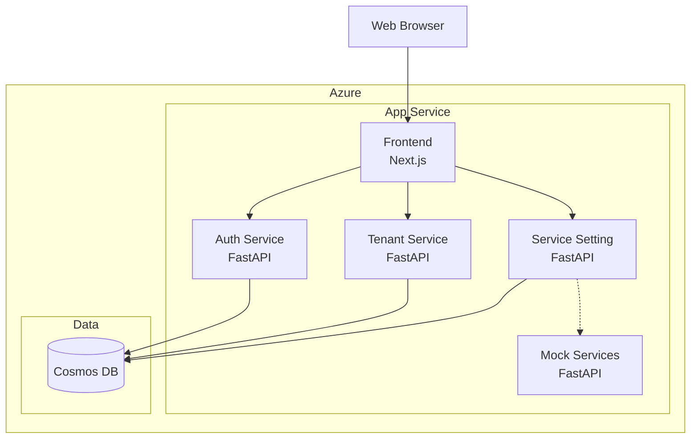
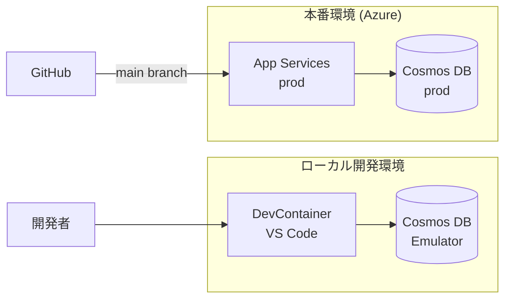
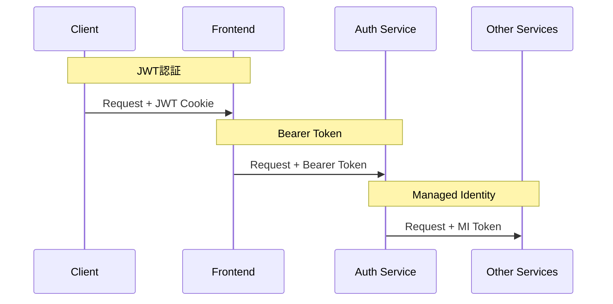

# アーキテクチャ設計

このフォルダにはシステム全体のアーキテクチャ設計に関するドキュメントが格納されています。

## ドキュメント一覧

| ドキュメント | 説明 |
|-------------|------|
| [認証フロー](./authentication-flow.md) | JWT認証の詳細フロー、トークン管理 |
| [データベース設計](./database-design.md) | Cosmos DB設計方針、パーティション戦略 |
| [API設計ガイドライン](./api-guidelines.md) | REST API設計の共通ルール |

## システム構成図



## 技術選定理由

### フロントエンド: Next.js

- **BFF (Backend for Frontend)** パターンの実現
- SSR/SSGによるパフォーマンス最適化
- React エコシステムの活用

### バックエンド: FastAPI (Python)

- 高速な開発サイクル
- 自動ドキュメント生成 (OpenAPI)
- 非同期処理のサポート
- 型ヒントによるコード品質向上

### データベース: Cosmos DB

- マネージドサービスによる運用負荷軽減
- グローバル分散対応
- 柔軟なスキーマ設計
- マイクロサービス毎のコンテナ分離

### IaC: Bicep

- Azure ネイティブの IaC
- ARM テンプレートより簡潔な記述
- VS Code による強力なツーリング支援

## 環境構成

本システムは以下の2環境で構成します。

| 環境 | 用途 | 特徴 |
|------|------|------|
| 開発 (dev) | 開発・テスト | DevContainer + Cosmos DB Emulator |
| 本番 (prod) | 本番運用 | Azure App Service + Cosmos DB |



## ローカル開発環境 (DevContainer)

### 概要

ローカル開発環境は [DevContainer](https://containers.dev/) を使用して構築します。これにより、開発者全員が同一の環境で開発できます。

### DevContainer構成

```
.devcontainer/
├── devcontainer.json      # DevContainer設定
├── docker-compose.yml     # サービス構成
├── Dockerfile             # 開発用コンテナ
└── scripts/
    └── post-create.sh     # 初期化スクリプト
```

### 含まれるサービス

| サービス | ポート | 説明 |
|---------|-------|------|
| Frontend (Next.js) | 3000 | BFFサービス |
| Auth Service | 8001 | 認証認可サービス |
| Tenant Service | 8002 | テナント管理サービス |
| Service Setting | 8003 | サービス設定サービス |
| Mock Services | 8004 | モックサービス群 |
| Cosmos DB Emulator | 8081 | データベース |

### Cosmos DB Emulator

ローカル開発ではAzure Cosmos DB Emulatorを使用します。

```yaml
# docker-compose.yml (抜粋)
cosmosdb:
  image: mcr.microsoft.com/cosmosdb/linux/azure-cosmos-emulator:latest
  ports:
    - "8081:8081"
    - "10251:10251"
    - "10252:10252"
    - "10253:10253"
    - "10254:10254"
  environment:
    - AZURE_COSMOS_EMULATOR_PARTITION_COUNT=10
    - AZURE_COSMOS_EMULATOR_ENABLE_DATA_PERSISTENCE=true
```

**接続設定**:

| 設定 | 値 |
|------|-----|
| Endpoint | `https://localhost:8081` |
| Account Key | エミュレータ固定キー（公開済み） |
| SSL | 自己署名証明書（開発時は検証スキップ） |

### 開発環境の起動

```bash
# VS Codeで開く
code .

# DevContainerで再オープン
# Ctrl+Shift+P → "Dev Containers: Reopen in Container"

# または CLI から
devcontainer up --workspace-folder .
```

### 環境変数

DevContainer内では以下の環境変数が設定されます：

```env
# Cosmos DB Emulator
COSMOS_ENDPOINT=https://cosmosdb:8081
COSMOS_KEY=C2y6yDjf5/R+ob0N8A7Cgv30VRDJIWEHLM+4QDU5DE2nQ9nDuVTqobD4b8mGGyPMbIZnqyMsEcaGQy67XIw/Jw==

# サービス間認証スキップ
SKIP_SERVICE_AUTH=true

# 開発モード
ENVIRONMENT=development
```

## サービス間通信

### 認証方式

| 通信種別 | 認証方式 | 備考 |
|---------|---------|------|
| クライアント → Frontend | JWT (HttpOnly Cookie) | ユーザー認証 |
| Frontend → Backend | JWT (Bearer Token) | リクエスト転送 |
| Backend → Backend | Azure Managed Identity | サービス間通信 |
| ローカル開発時 | 認証なし | 開発効率優先 |



### Managed Identity設定

- 各App Serviceにシステム割り当てマネージドIDを有効化
- 呼び出し先サービスのApp ServiceでIDに対するロール割り当て
- ローカル開発時は環境変数 `SKIP_SERVICE_AUTH=true` で認証スキップ

## 初期データ投入

### デプロイスクリプト方式

システム稼働に必要な初期データは、デプロイスクリプトで投入します。

```bash
# デプロイ時に実行
./scripts/seed-data.sh --env prod
```

### シードデータ内容

| データ | 説明 |
|-------|------|
| 特権テナント | システム管理用テナント（編集・削除不可） |
| 初期管理者ユーザー | 全体管理者ロールを持つ初期ユーザー |
| コアサービス定義 | 必須サービス（認証、テナント管理、サービス設定） |
| モックサービス定義 | 開発・テスト用サービス |

### 初期管理者の初期パスワード

- 環境変数 `INITIAL_ADMIN_PASSWORD` で指定
- 初回ログイン時にパスワード変更を強制
