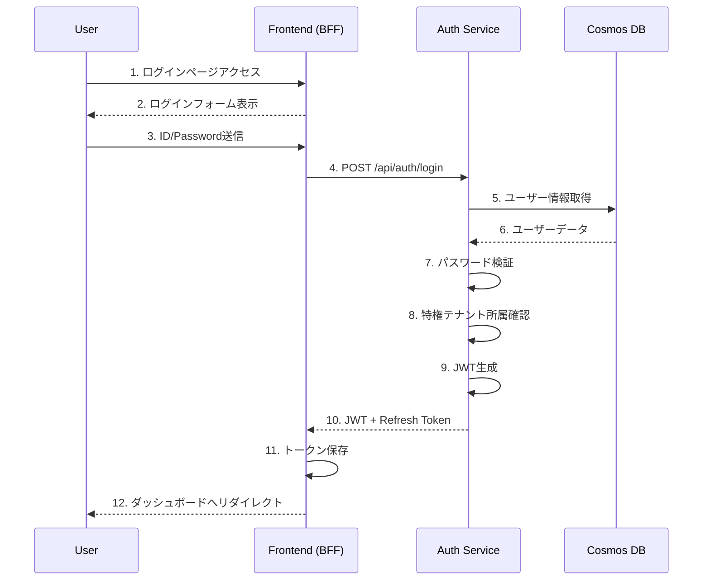
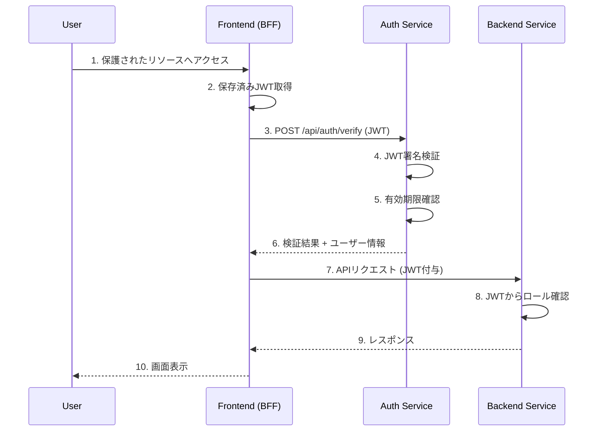
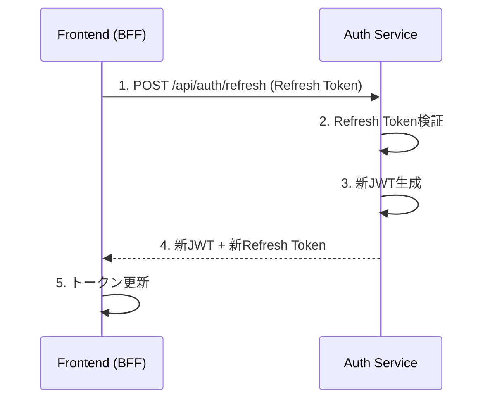
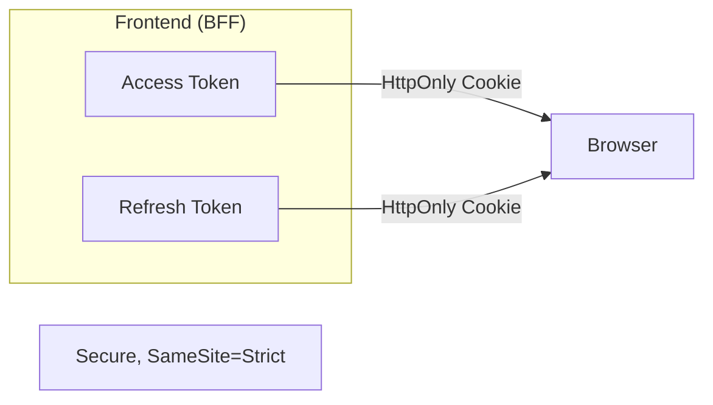
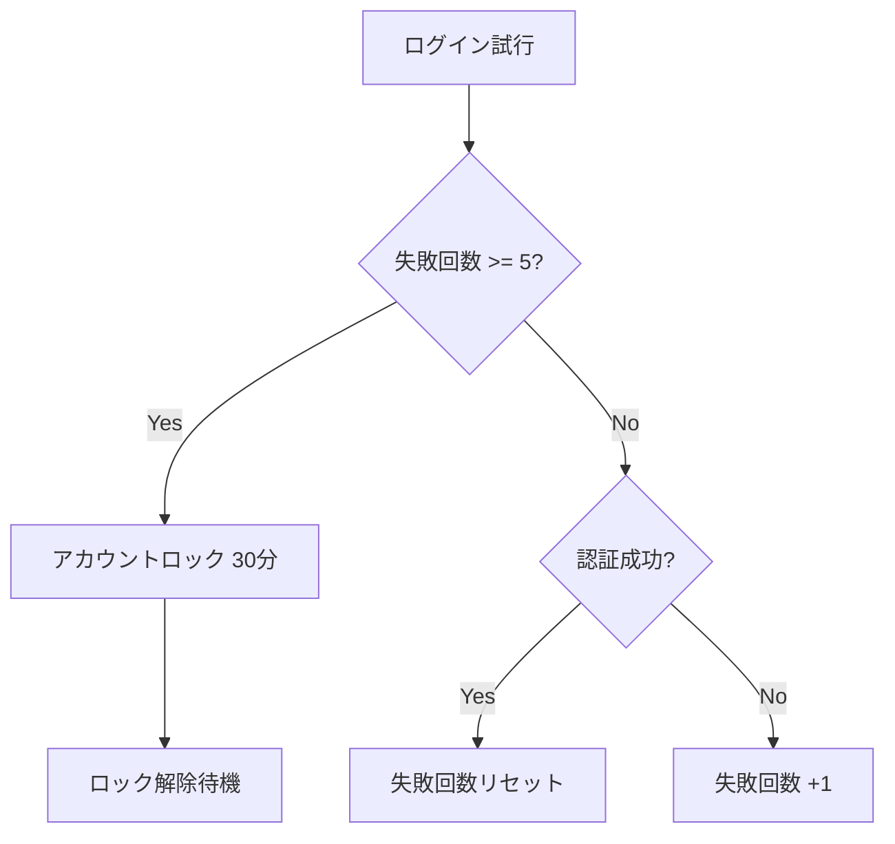

# 認証フロー

## 概要

本システムではJWT (JSON Web Token) を使用した認証・認可を実装します。

## 認証シーケンス

### ログインフロー



### 認証済みリクエストフロー



### トークンリフレッシュフロー



## JWT構造

### Header

```json
{
  "alg": "RS256",
  "typ": "JWT"
}
```

### Payload

```json
{
  "sub": "user-001",
  "name": "システム管理者",
  "tenants": [
    {
      "id": "tenant-001",
      "name": "特権テナント",
      "isPrivileged": true
    }
  ],
  "roles": {
    "auth-service": ["全体管理者"],
    "user-management-service": ["管理者"],
    "service-setting-service": ["全体管理者"]
  },
  "iat": 1706083200,
  "exp": 1706086800,
  "iss": "auth-service",
  "aud": "management-app"
}
```

### フィールド説明

| フィールド | 型 | 説明 |
|-----------|-----|------|
| sub | string | ユーザーID |
| name | string | ユーザー名（表示用） |
| tenants | array | 所属テナント情報 |
| roles | object | サービス毎のロール情報 |
| iat | number | 発行日時 (Unix timestamp) |
| exp | number | 有効期限 (Unix timestamp) |
| iss | string | 発行者 |
| aud | string | 対象アプリケーション |

## トークン管理

### 有効期限

| トークン種別 | 有効期限 | 用途 |
|-------------|---------|------|
| Access Token (JWT) | 1時間 | API認証 |
| Refresh Token | 7日間 | Access Token再発行 |

### 保存場所



**セキュリティ考慮事項**:
- HttpOnly Cookie を使用（JavaScript からのアクセス不可）
- Secure フラグ有効（HTTPS必須）
- SameSite=Strict（CSRF対策）

## エラーハンドリング

### 認証エラーコード

| コード | HTTP Status | 説明 | 対処 |
|-------|-------------|------|------|
| AUTH001 | 401 | 認証情報なし | ログインページへリダイレクト |
| AUTH002 | 401 | 無効なトークン | ログインページへリダイレクト |
| AUTH003 | 401 | トークン期限切れ | リフレッシュ試行 |
| AUTH004 | 401 | ユーザーが無効 | ログインページへリダイレクト |
| AUTH005 | 403 | 権限不足 | エラーメッセージ表示 |
| AUTH006 | 403 | 特権テナント非所属 | アクセス拒否メッセージ表示 |
| AUTH007 | 423 | アカウントロック | ロック解除待機メッセージ表示 |

### エラーレスポンス形式

```json
{
  "error": {
    "code": "AUTH003",
    "message": "トークンの有効期限が切れています",
    "details": {
      "expiredAt": "2026-01-24T10:00:00Z"
    }
  }
}
```

## セキュリティ対策

### ブルートフォース対策



### トークン無効化

以下のケースでトークンを無効化:

1. ユーザーがログアウト
2. パスワード変更
3. ユーザー無効化
4. 管理者による強制ログアウト

## 実装ノート

### Frontend (Next.js)

```typescript
// middleware.ts での認証チェック例
export async function middleware(request: NextRequest) {
  const token = request.cookies.get('access_token');
  
  if (!token) {
    return NextResponse.redirect(new URL('/login', request.url));
  }
  
  // 必要に応じてトークン検証APIを呼び出し
  return NextResponse.next();
}
```

### Backend (FastAPI)

```python
# 認証依存関係の例
async def get_current_user(
    token: str = Depends(oauth2_scheme)
) -> User:
    credentials_exception = HTTPException(
        status_code=401,
        detail="認証に失敗しました",
        headers={"WWW-Authenticate": "Bearer"},
    )
    try:
        payload = jwt.decode(token, PUBLIC_KEY, algorithms=["RS256"])
        user_id: str = payload.get("sub")
        if user_id is None:
            raise credentials_exception
    except JWTError:
        raise credentials_exception
    
    user = await get_user(user_id)
    if user is None:
        raise credentials_exception
    return user
```
