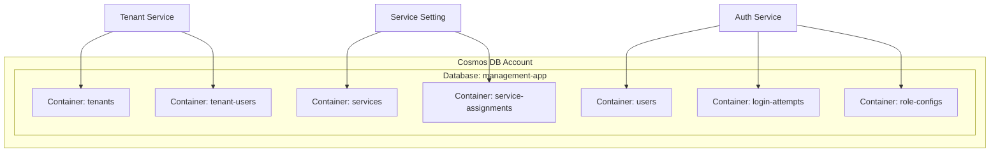
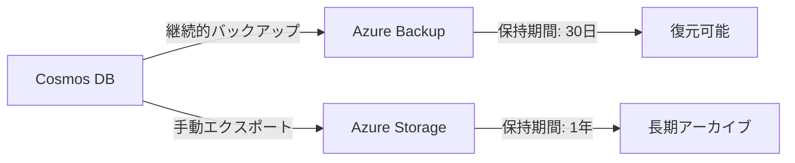
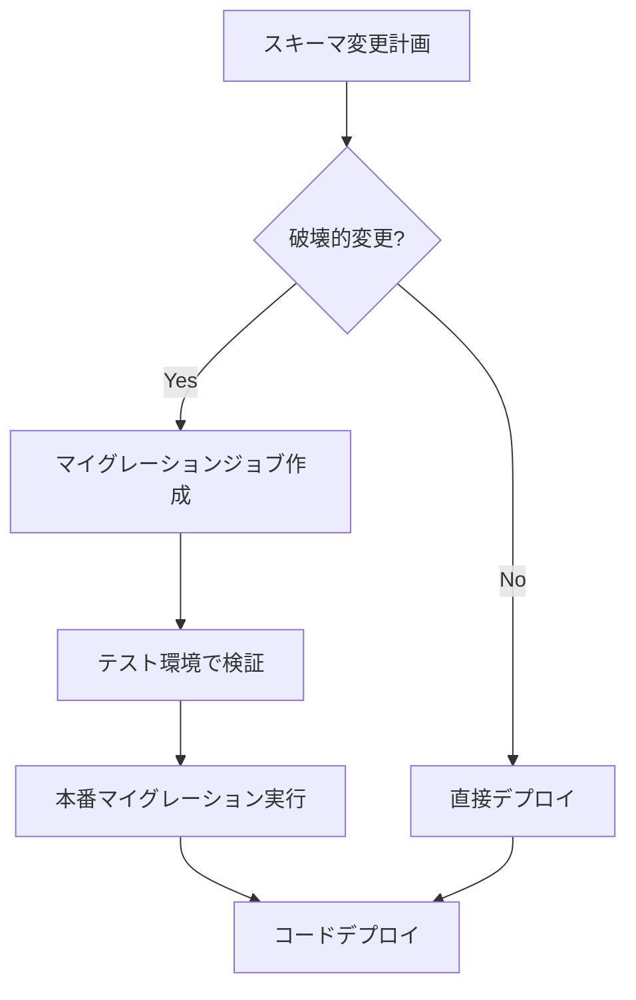

# データベース設計

## 概要

本システムではAzure Cosmos DBをデータストアとして使用します。マイクロサービスアーキテクチャに合わせて、サービス毎にコンテナを分離します。

## Cosmos DB構成



## コンテナ設計

### サービス別コンテナマッピング

| サービス | コンテナ | パーティションキー |
|---------|--------|------------------|
| 認証認可 | users | /id |
| 認証認可 | login-attempts | /loginId |
| 認証認可 | role-configs | /serviceId |
| テナント管理 | tenants | /id |
| テナント管理 | tenant-users | /tenantId |
| サービス設定 | services | /id |
| サービス設定 | service-assignments | /tenantId |

### パーティション戦略

#### usersコンテナ

```json
{
  "partitionKey": "/id",
  "理由": "ユーザーIDでの直接アクセスが主パターン",
  "クロスパーティションクエリ": "loginIdでの検索時に発生"
}
```

#### tenant-usersコンテナ

```json
{
  "partitionKey": "/tenantId",
  "理由": "テナント別ユーザー一覧取得が主パターン",
  "利点": "テナント内のユーザー操作は単一パーティション"
}
```

#### service-assignmentsコンテナ

```json
{
  "partitionKey": "/tenantId",
  "理由": "テナント別サービス一覧取得が主パターン",
  "利点": "テナントへの割当操作は単一パーティション"
}
```

## スキーマ定義

### users

```json
{
  "id": "user-001",
  "loginId": "admin@example.com",
  "name": "システム管理者",
  "passwordHash": "$2b$12$xxx...",
  "isActive": true,
  "lockedUntil": null,
  "roles": [
    {
      "serviceId": "auth",
      "roleId": "admin",
      "roleName": "全体管理者"
    }
  ],
  "tenantIds": ["tenant-001"],
  "createdAt": "2026-01-01T00:00:00Z",
  "updatedAt": "2026-01-01T00:00:00Z",
  "_type": "User"
}
```

### tenants

```json
{
  "id": "tenant-001",
  "name": "特権テナント",
  "isPrivileged": true,
  "allowedDomains": ["example.com"],
  "createdAt": "2026-01-01T00:00:00Z",
  "updatedAt": "2026-01-01T00:00:00Z",
  "_type": "Tenant"
}
```

### tenant-users

```json
{
  "id": "tu-001",
  "tenantId": "tenant-001",
  "userId": "user-001",
  "addedAt": "2026-01-01T00:00:00Z",
  "_type": "TenantUser"
}
```

### services

```json
{
  "id": "file-management",
  "name": "ファイル管理サービス",
  "description": "ファイルのアップロード、ダウンロード、管理",
  "roleEndpoint": "http://mock-services/api/file-management/roles",
  "isCore": false,
  "isActive": true,
  "roles": [
    {
      "id": "file-admin",
      "name": "ファイル管理者",
      "description": "ファイル管理の全権限"
    }
  ],
  "createdAt": "2026-01-01T00:00:00Z",
  "updatedAt": "2026-01-01T00:00:00Z",
  "_type": "Service"
}
```

### service-assignments

```json
{
  "id": "sa-001",
  "tenantId": "tenant-002",
  "serviceId": "file-management",
  "assignedAt": "2026-01-15T10:00:00Z",
  "assignedBy": "user-001",
  "_type": "ServiceAssignment"
}
```

### login-attempts

```json
{
  "id": "la-001",
  "loginId": "admin@example.com",
  "userId": "user-001",
  "isSuccess": false,
  "ipAddress": "192.168.1.1",
  "attemptedAt": "2026-01-24T09:00:00Z",
  "ttl": 7776000,
  "_type": "LoginAttempt"
}
```

## インデックスポリシー

### 基本方針

- 自動インデックスを使用
- 必要に応じて複合インデックスを追加
- 書き込みが多いコンテナは除外パスを設定

### usersコンテナ

```json
{
  "indexingMode": "consistent",
  "automatic": true,
  "includedPaths": [
    {"path": "/loginId/?"},
    {"path": "/isActive/?"},
    {"path": "/tenantIds/*"}
  ],
  "excludedPaths": [
    {"path": "/passwordHash/?"}
  ],
  "compositeIndexes": [
    [
      {"path": "/isActive", "order": "ascending"},
      {"path": "/createdAt", "order": "descending"}
    ]
  ]
}
```

### login-attemptsコンテナ

```json
{
  "indexingMode": "consistent",
  "automatic": true,
  "includedPaths": [
    {"path": "/loginId/?"},
    {"path": "/attemptedAt/?"},
    {"path": "/isSuccess/?"}
  ],
  "compositeIndexes": [
    [
      {"path": "/loginId", "order": "ascending"},
      {"path": "/attemptedAt", "order": "descending"}
    ]
  ]
}
```

## TTL設定

| コンテナ | TTL | 理由 |
|---------|-----|------|
| login-attempts | 90日 | セキュリティ監査用に90日保持 |

## 一貫性レベル

| コンテナ | 一貫性レベル | 理由 |
|---------|-------------|------|
| users | Strong | 認証データは即座に反映が必要 |
| tenants | Bounded Staleness | 若干の遅延は許容可能 |
| service-assignments | Session | セッション内の一貫性で十分 |
| login-attempts | Eventual | 監査ログは厳密な一貫性不要 |

## バックアップ戦略



### ポイントインタイムリストア

- 継続的バックアップモード有効
- 任意の時点に復元可能（最大30日前まで）

## マイグレーション戦略

### スキーマ変更時のアプローチ

1. **後方互換性のある追加**: 新フィールドを追加（nullable）
2. **データマイグレーション**: バッチ処理で既存データを更新
3. **コード更新**: 新フィールドを使用するコードをデプロイ
4. **クリーンアップ**: 不要な古いフィールドを削除


