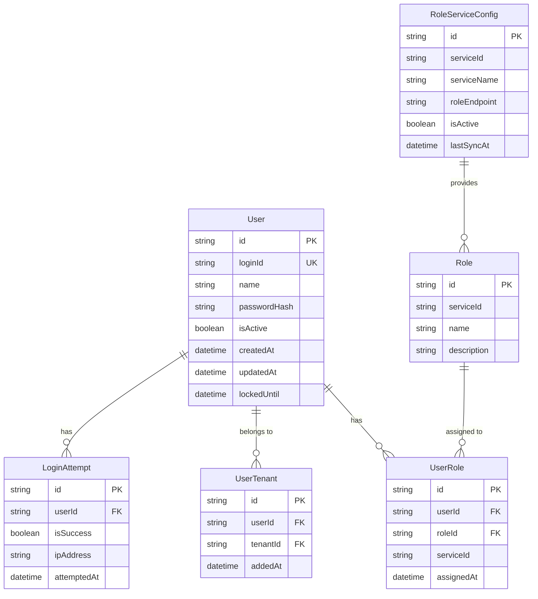
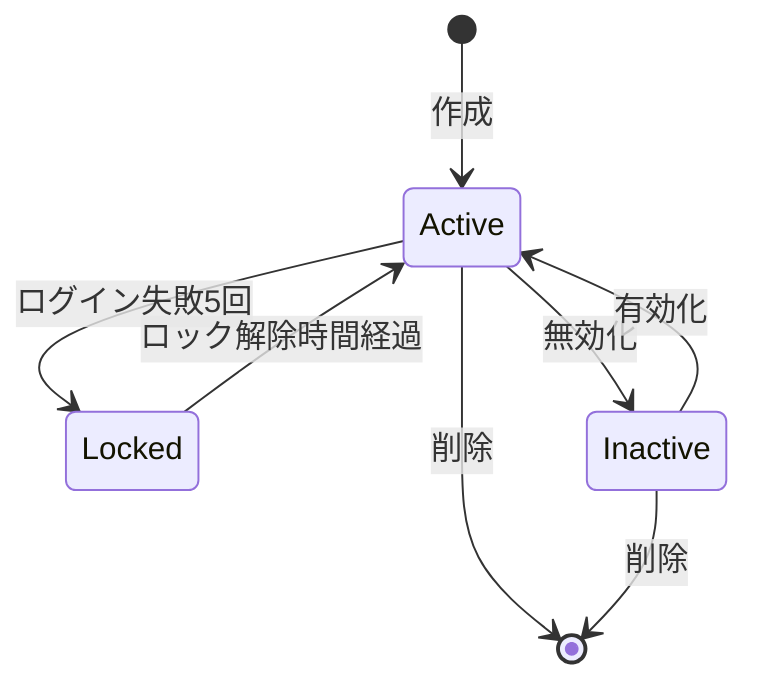

# 認証認可サービス データモデル

**サービス名**: 認証認可サービス  
**データベース**: Cosmos DB  
**最終更新**: 2026-01-24

## エンティティ関連図



## エンティティ定義

### User (ユーザー)

システムのユーザー情報を保持します。

| フィールド | 型 | 必須 | 説明 |
|-----------|-----|------|------|
| id | string | Yes | ユーザーID (UUID) |
| loginId | string | Yes | ログインID（ユニーク） |
| name | string | Yes | ユーザー名（表示名） |
| passwordHash | string | Yes | パスワードハッシュ (bcrypt) |
| isActive | boolean | Yes | アクティブフラグ |
| createdAt | datetime | Yes | 作成日時 |
| updatedAt | datetime | Yes | 更新日時 |
| lockedUntil | datetime | No | アカウントロック解除日時 |

**ビジネスルール**:
- `loginId` はシステム内で一意
- パスワードは bcrypt (cost=12) でハッシュ化
- `lockedUntil` が現在時刻より未来の場合、ログイン不可

```json
{
  "id": "user-001",
  "loginId": "admin@example.com",
  "name": "システム管理者",
  "passwordHash": "$2b$12$xxx...",
  "isActive": true,
  "createdAt": "2026-01-01T00:00:00Z",
  "updatedAt": "2026-01-01T00:00:00Z",
  "lockedUntil": null
}
```

### UserRole (ユーザーロール)

ユーザーとロールの関連を管理します。

| フィールド | 型 | 必須 | 説明 |
|-----------|-----|------|------|
| id | string | Yes | レコードID (UUID) |
| userId | string | Yes | ユーザーID |
| roleId | string | Yes | ロールID |
| serviceId | string | Yes | サービスID |
| assignedAt | datetime | Yes | 割当日時 |

**ビジネスルール**:
- 同一ユーザー・同一ロールの組み合わせは一意
- テナントが利用できないサービスのロールは割当不可

```json
{
  "id": "ur-001",
  "userId": "user-001",
  "roleId": "role-auth-admin",
  "serviceId": "auth-service",
  "assignedAt": "2026-01-01T00:00:00Z"
}
```

### UserTenant (ユーザーテナント)

ユーザーとテナントの所属関係を管理します。

| フィールド | 型 | 必須 | 説明 |
|-----------|-----|------|------|
| id | string | Yes | レコードID (UUID) |
| userId | string | Yes | ユーザーID |
| tenantId | string | Yes | テナントID |
| addedAt | datetime | Yes | 追加日時 |

**ビジネスルール**:
- 同一ユーザー・同一テナントの組み合わせは一意
- ユーザーは複数テナントに所属可能

```json
{
  "id": "ut-001",
  "userId": "user-001",
  "tenantId": "tenant-001",
  "addedAt": "2026-01-01T00:00:00Z"
}
```

### Role (ロール)

サービス毎のロール定義を保持します（外部サービスから同期）。

| フィールド | 型 | 必須 | 説明 |
|-----------|-----|------|------|
| id | string | Yes | ロールID (例: role-auth-admin) |
| serviceId | string | Yes | サービスID |
| name | string | Yes | ロール名 |
| description | string | No | ロール説明 |

```json
{
  "id": "role-auth-admin",
  "serviceId": "auth-service",
  "name": "全体管理者",
  "description": "ユーザーの登録・削除を行うことが可能"
}
```

### RoleServiceConfig (ロールサービス設定)

ロール情報を取得する外部サービスの設定を保持します。

| フィールド | 型 | 必須 | 説明 |
|-----------|-----|------|------|
| id | string | Yes | 設定ID (UUID) |
| serviceId | string | Yes | サービスID |
| serviceName | string | Yes | サービス名 |
| roleEndpoint | string | Yes | ロール取得エンドポイントURL |
| isActive | boolean | Yes | アクティブフラグ |
| lastSyncAt | datetime | No | 最終同期日時 |

**ビジネスルール**:
- `isActive = true` のサービスのみロール収集対象
- `roleEndpoint` は GET リクエストでロール一覧を返すこと

```json
{
  "id": "rsc-001",
  "serviceId": "user-management-service",
  "serviceName": "テナント管理サービス",
  "roleEndpoint": "http://user-management-service/api/roles",
  "isActive": true,
  "lastSyncAt": "2026-01-24T10:00:00Z"
}
```

### LoginAttempt (ログイン試行)

ログイン試行の履歴を保持します（セキュリティ監査用）。

| フィールド | 型 | 必須 | 説明 |
|-----------|-----|------|------|
| id | string | Yes | レコードID (UUID) |
| userId | string | No | ユーザーID（特定できた場合） |
| loginId | string | Yes | 試行されたログインID |
| isSuccess | boolean | Yes | 成功フラグ |
| ipAddress | string | Yes | 接続元IPアドレス |
| attemptedAt | datetime | Yes | 試行日時 |

**ビジネスルール**:
- 同一 `loginId` で30分以内に5回失敗した場合、アカウントロック
- 90日以上経過したレコードは自動削除

```json
{
  "id": "la-001",
  "userId": "user-001",
  "loginId": "admin@example.com",
  "isSuccess": false,
  "ipAddress": "192.168.1.1",
  "attemptedAt": "2026-01-24T09:00:00Z"
}
```

## JWT構造

```json
{
  "header": {
    "alg": "RS256",
    "typ": "JWT"
  },
  "payload": {
    "sub": "user-001",
    "name": "システム管理者",
    "tenants": ["tenant-001"],
    "roles": {
      "auth-service": ["全体管理者"],
      "user-management-service": ["管理者"]
    },
    "iat": 1706083200,
    "exp": 1706086800
  }
}
```

## インデックス設計

### Userコンテナ

| インデックス | フィールド | 用途 |
|-------------|-----------|------|
| Primary | id | 主キー検索 |
| Unique | loginId | ログインID検索、一意性保証 |
| Secondary | isActive | アクティブユーザー絞り込み |

### UserRoleコンテナ

| インデックス | フィールド | 用途 |
|-------------|-----------|------|
| Primary | id | 主キー検索 |
| Composite | userId, roleId | 一意性保証 |
| Secondary | userId | ユーザー別ロール検索 |
| Secondary | serviceId | サービス別ロール検索 |

## 状態遷移

### ユーザーアカウント状態


