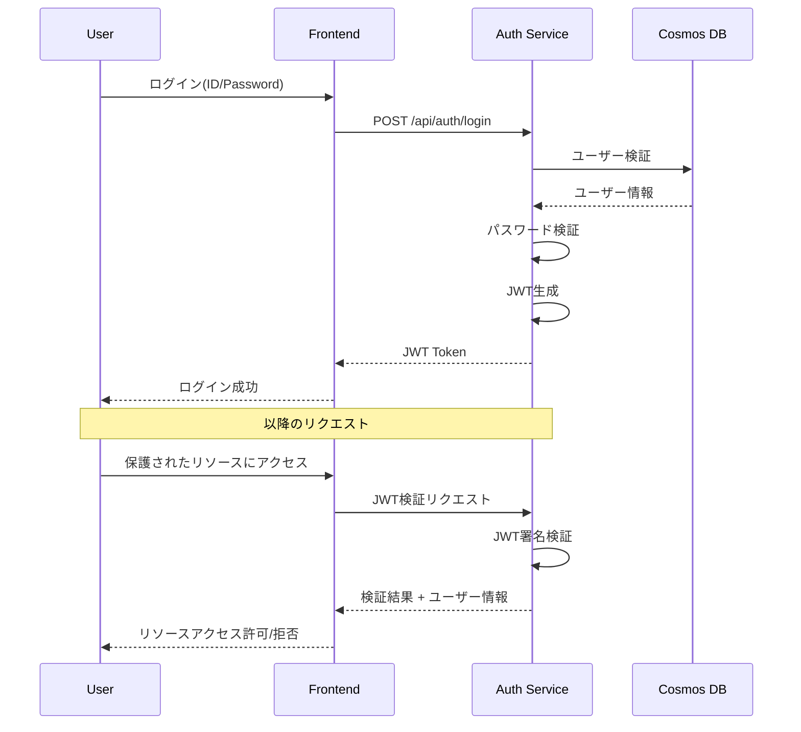
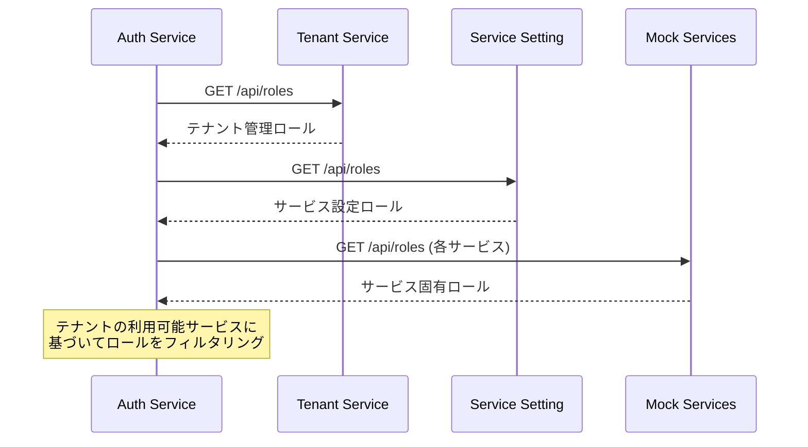

# 認証認可サービス仕様書

**サービス名**: 認証認可サービス (Auth Service)  
**リポジトリ**: ws-demo-poly3  
**技術スタック**: FastAPI (Python)  
**データベース**: Cosmos DB  
**最終更新**: 2026-01-24  
**ステータス**: Draft

## 概要

ユーザーの認証とユーザーが持つ権限の管理を行うサービスです。ID/パスワードによる認証と、JWTを使用した認可を提供します。

## ロール定義

| ロール | 説明 | 権限 |
|-------|------|------|
| 全体管理者 | ユーザー管理の全権限 | ユーザーの登録・削除が可能 |
| 閲覧者 | 参照専用 | ユーザーの参照のみ可能 |

## 認証フロー

## ロール収集フロー

各サービスから提供されるロール情報を収集し、ユーザーに設定可能なロールを動的に決定します。

## ユーザーシナリオ

### US-1: ユーザー認証 (Priority: P1) 🎯 MVP

ユーザーとして、ID/パスワードでログインし、認証トークンを取得できる。

**受入条件**:
1. **Given** 有効なユーザーアカウント, **When** 正しいID/パスワードでログインする, **Then** JWTが返却される
2. **Given** 有効なユーザーアカウント, **When** 誤ったパスワードでログインする, **Then** 認証エラーが返却される
3. **Given** 存在しないユーザーID, **When** ログインを試みる, **Then** 認証エラーが返却される
4. **Given** ログイン成功時, **When** JWTを確認する, **Then** ユーザーID、ロール情報、有効期限が含まれている

### US-2: JWT検証 (Priority: P1) 🎯 MVP

システムとして、リクエストに含まれるJWTを検証し、認可判断を行える。

**受入条件**:
1. **Given** 有効なJWT, **When** 検証リクエストを送る, **Then** 検証成功とユーザー情報が返却される
2. **Given** 期限切れのJWT, **When** 検証リクエストを送る, **Then** 検証失敗が返却される
3. **Given** 改ざんされたJWT, **When** 検証リクエストを送る, **Then** 検証失敗が返却される

### US-3: ユーザー一覧表示 (Priority: P2)

管理者として、登録されているユーザーの一覧を確認できる。

**受入条件**:
1. **Given** 閲覧者以上のロール, **When** ユーザー一覧を取得する, **Then** 以下の情報が表示される
   - ユーザー名
   - ユーザーID
   - 作成日
   - 所属テナント
2. **Given** ユーザー一覧画面, **When** テナントでフィルタする, **Then** 該当テナントのユーザーのみ表示される

### US-4: ユーザー登録 (Priority: P2)

全体管理者として、新規ユーザーを登録できる。

**受入条件**:
1. **Given** 全体管理者ロール, **When** ユーザー情報を入力して登録する, **Then** 新規ユーザーが作成される
2. **Given** 新規ユーザー作成時, **When** 初期パスワードを設定する, **Then** ハッシュ化されて保存される
3. **Given** ユーザー登録時, **When** 既存のユーザーIDを入力する, **Then** エラーが返却される

### US-5: ユーザー編集 (Priority: P2)

全体管理者として、ユーザー情報を編集できる。

**受入条件**:
1. **Given** 全体管理者ロール, **When** ユーザー詳細画面を開く, **Then** 以下を編集できる
   - ユーザー名
   - 初期パスワード（リセット）
   - 所持ロール
2. **Given** ロール編集時, **When** テナントが使用できないサービスのロールを設定しようとする, **Then** そのロール選択肢は表示されない

### US-6: ユーザー削除 (Priority: P3)

全体管理者として、ユーザーを削除できる。

**受入条件**:
1. **Given** 全体管理者ロール, **When** ユーザーを削除する, **Then** ユーザーが削除される
2. **Given** 削除対象が自分自身, **When** 削除を試みる, **Then** エラーが表示される

## 機能要件

### FR-001: 認証

- システムは ID/パスワードによる認証機能を提供しなければならない
- システムはパスワードをハッシュ化して保存しなければならない
- システムは認証成功時にJWTを発行しなければならない

### FR-002: JWT管理

- JWTには以下の情報を含めなければならない
  - ユーザーID
  - ユーザー名
  - 所属テナントID（複数所属の場合は配列）
  - ロール情報（テナント別・サービス別）
  - 発行日時
  - 有効期限
- システムはJWTの検証エンドポイントを提供しなければならない
- JWTの署名アルゴリズムはRS256を使用すること
- ユーザーが複数テナントに所属する場合、ログイン時に操作対象テナントを選択できること

### FR-003: ユーザー管理

- システムはユーザーのCRUD操作を提供しなければならない
- システムはユーザー削除時に関連データを適切に処理しなければならない

### FR-004: ロール管理

- システムは各サービスからロール情報を収集しなければならない
- システムはテナントの利用可能サービスに基づいてロールをフィルタリングしなければならない
- ロール情報取得WebAPIの設定はDBテーブルに格納される

### FR-005: ロール情報提供

- システムは自サービスで定義されるロール情報をAPIで提供しなければならない

## API エンドポイント

詳細は [API仕様書](./api-spec.md) を参照。

| メソッド | エンドポイント | 説明 | 認証 |
|---------|---------------|------|------|
| POST | `/api/auth/login` | ログイン（JWT発行） | 不要 |
| POST | `/api/auth/verify` | JWT検証 | Bearer Token |
| POST | `/api/auth/refresh` | JWTリフレッシュ | Bearer Token |
| GET | `/api/users` | ユーザー一覧取得 | Bearer Token |
| GET | `/api/users/{id}` | ユーザー詳細取得 | Bearer Token |
| POST | `/api/users` | ユーザー作成 | Bearer Token (全体管理者) |
| PUT | `/api/users/{id}` | ユーザー更新 | Bearer Token (全体管理者) |
| DELETE | `/api/users/{id}` | ユーザー削除 | Bearer Token (全体管理者) |
| GET | `/api/users/{id}/roles` | ユーザーロール取得 | Bearer Token |
| PUT | `/api/users/{id}/roles` | ユーザーロール更新 | Bearer Token (全体管理者) |
| GET | `/api/roles` | 利用可能ロール一覧 | Bearer Token |
| GET | `/api/roles/definitions` | ロール情報取得（他サービス連携用） | Internal |
| POST | `/api/users/{id}/unlock` | アカウントロック解除 | Bearer Token (全体管理者) |

## 非機能要件

### NFR-001: セキュリティ

- パスワードはbcryptでハッシュ化すること
- ログイン試行は5回失敗でアカウントを一時ロックすること
- アカウントロックの解除は以下のいずれかで行えること
  - 30分経過による自動解除
  - 全体管理者による手動解除
- JWTの有効期限は1時間とすること
- リフレッシュトークンの有効期限は7日間とすること
- リフレッシュトークンは毎回ローテーションすること（再利用不可）

### NFR-002: パフォーマンス

- 認証リクエストは1秒以内にレスポンスを返すこと
- JWT検証は100ms以内に完了すること

## 成功基準

- **SC-001**: 認証リクエストの99%が1秒以内に完了する
- **SC-002**: JWT検証の99.9%が100ms以内に完了する
- **SC-003**: 不正なJWTは100%拒否される
- **SC-004**: パスワードが平文で保存・送信されることはない
